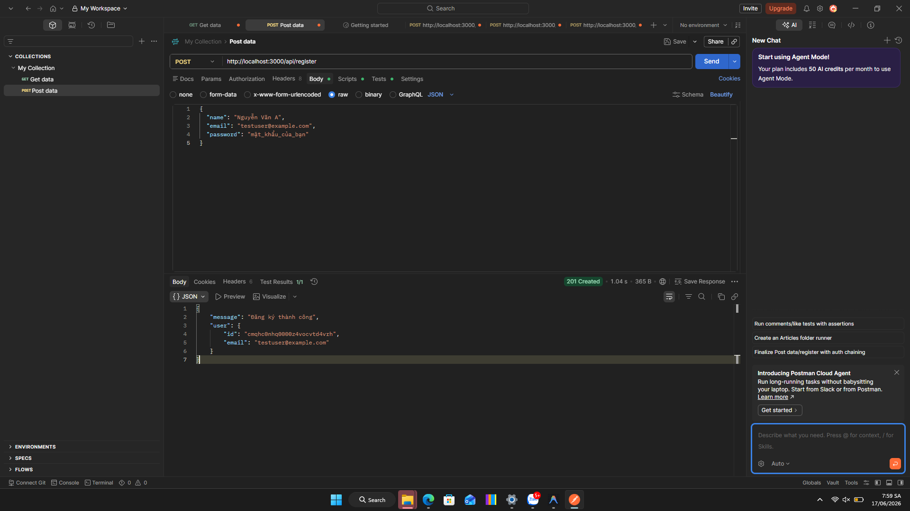
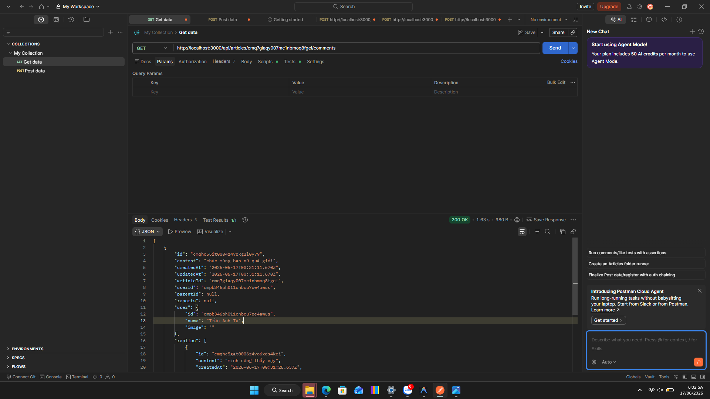
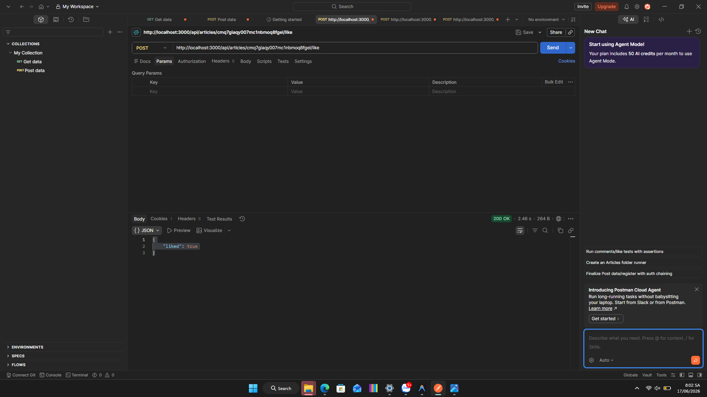
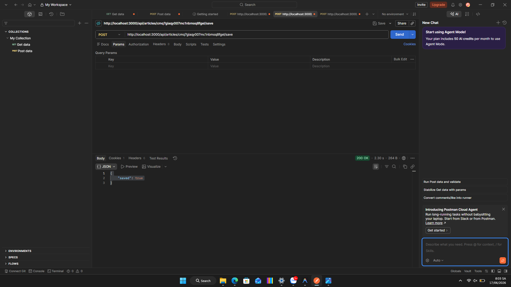
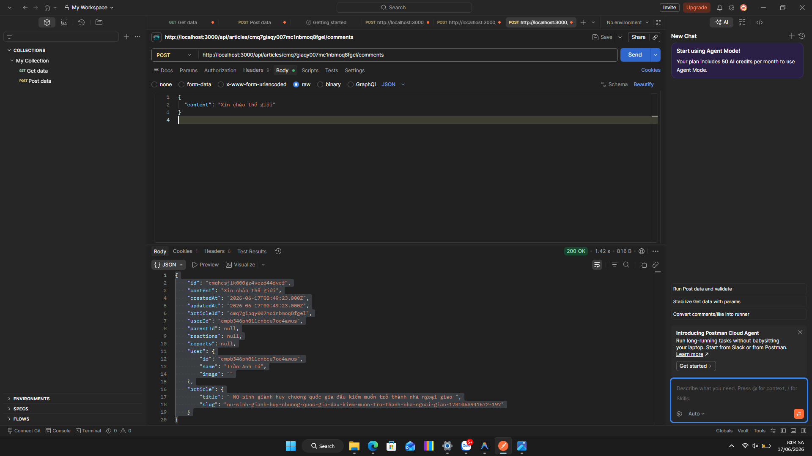

# Báo Cáo Kiểm Thử API - VinaNews

Tài liệu này ghi lại kết quả kiểm thử thủ công các API của dự án VinaNews bằng công cụ **Postman** ở môi trường local (`http://localhost:3000`).

---

## I. Môi Trường Kiểm Thử
* **Địa chỉ server:** `http://localhost:3000`
* **Công cụ sử dụng:** Postman Desktop Agent
* **Phương pháp xác thực:** Với các API yêu cầu đăng nhập, sử dụng Cookie `next-auth.session-token` lấy từ phiên đăng nhập thực tế của người dùng `Trần Anh Tú` (ID: `cmpb346ph011cnbcu7oe4awus`) trên trình duyệt để đính kèm vào header của Postman.

---

## II. Hướng Dẫn Các Bước Thao Tác Trên Postman

### 1. Đối với các API Công Khai (Public)
1. **Khởi chạy ứng dụng:** Mở terminal tại thư mục gốc dự án và chạy lệnh:
   ```bash
   npm run dev
   ```
2. **Cấu hình Request trong Postman:**
   * Tạo một Request mới.
   * Thiết lập **Phương thức** (GET/POST) và **Đường dẫn (URL)** tương ứng của API.
3. **Cấu hình Request Body (nếu API yêu cầu, ví dụ: `/api/register`):**
   * Chuyển sang tab **Body** nằm ngay dưới thanh địa chỉ URL.
   * Chọn tùy chọn **raw**.
   * Ở menu định dạng ngoài cùng bên phải, chọn **JSON**.
   * Điền nội dung JSON mẫu cần truyền vào khung soạn thảo.
4. **Gửi Request:** Nhấn nút **Send** để thực thi và xem kết quả trả về ở khung Response bên dưới.

### 2. Đối với các API Yêu Cầu Đăng Nhập (Authenticated)
Để vượt qua kiểm tra Session và tránh lỗi `401 Unauthorized`, thực hiện theo các bước sau:
1. **Đăng nhập trên trình duyệt:** 
   * Truy cập `http://localhost:3000` bằng trình duyệt web.
   * Đăng nhập tài khoản của bạn (ví dụ tài khoản: `Trần Anh Tú`).
2. **Lấy Token phiên đăng nhập:**
   * Nhấn phím **F12** (hoặc chuột phải chọn *Kiểm tra/Inspect*) để mở Công cụ nhà phát triển.
   * Chọn tab **Application** (trên Chrome/Edge) hoặc **Storage** (trên Firefox).
   * Tại thanh menu bên trái, tìm mục **Cookies** và chọn `http://localhost:3000`.
   * Tìm cookie có tên **`next-auth.session-token`** và sao chép (copy) toàn bộ giá trị (Value) của nó.
3. **Cấu hình Header trong Postman:**
   * Tại Request đang thiết lập trong Postman, chọn tab **Headers**.
   * Thêm một cặp Key-Value mới:
     * **Key:** `Cookie`
     * **Value:** `next-auth.session-token=<Giá_trị_cookie_đã_copy_ở_bước_trên>`
4. **Gửi Request:** Đảm bảo phương thức là `POST`, điền URL và Request Body (nếu có), sau đó nhấn **Send**.

---

## III. Kết Quả Kiểm Thử API Công Khai (Public APIs)

### 1. Đăng Ký Tài Khoản Mới

* **Phương thức:** `POST`
* **Đường dẫn:** `http://localhost:3000/api/register`
* **Body gửi lên (JSON):**
  ```json
  {
    "name": "Nguyen Van A",
    "email": "testuser@example.com",
    "password": "yourpassword123"
  }
  ```
* **Kết quả trả về (Response - 201 Created):**
  ```json
  {
      "message": "Đăng ký thành công",
      "user": {
          "id": "cmqhc0nhq0000z4vocvtd4vrh",
          "email": "testuser@example.com"
      }
  }
  ```
* **Trạng thái:** Hoạt động tốt.

### 2. Lấy Danh Sách Bình Luận Của Bài Viết

* **Phương thức:** `GET`
* **Đường dẫn:** `http://localhost:3000/api/articles/cmq7giaqy007mc1nbmoq8fgel/comments`
* **Kết quả trả về (Response - 200 OK):**
  ```json
  [
      {
          "id": "cmqhc55it0004z4vokg2l0y79",
          "content": "chúc mừng bạn nữ quá giỏi",
          "createdAt": "2026-06-17T00:31:11.670Z",
          "updatedAt": "2026-06-17T00:31:11.670Z",
          "articleId": "cmq7giaqy007mc1nbmoq8fgel",
          "userId": "cmpb346ph011cnbcu7oe4awus",
          "parentId": null,
          "reports": null,
          "user": {
              "id": "cmpb346ph011cnbcu7oe4awus",
              "name": "Trần Anh Tú",
              "image": ""
          },
          "replies": [
              {
                  "id": "cmqhc5gat0006z4vo6xds4kei",
                  "content": "mình cũng thấy vậy",
                  "createdAt": "2026-06-17T00:31:25.637Z",
                  "updatedAt": "2026-06-17T00:31:25.637Z",
                  "articleId": "cmq7giaqy007mc1nbmoq8fgel",
                  "userId": "cmpb346ph011cnbcu7oe4awus",
                  "parentId": "cmqhc55it0004z4vokg2l0y79",
                  "reports": null,
                  "user": {
                      "id": "cmpb346ph011cnbcu7oe4awus",
                      "name": "Trần Anh Tú",
                      "image": ""
                  },
                  "replies": []
              }
          ]
      }
  ]
  ```
* **Trạng thái:** Hoạt động tốt. API trả về cấu trúc phân cấp cây bình luận (bình luận con lồng trong mảng `replies` của bình luận cha) chính xác.

---

## IV. Kết Quả Kiểm Thử API Yêu Cầu Đăng Nhập (Authenticated APIs)

### 1. Thích Bài Viết (Like Article)

* **Phương thức:** `POST`
* **Đường dẫn:** `http://localhost:3000/api/articles/cmq7giaqy007mc1nbmoq8fgel/like`
* **Header:** Đã đính kèm Cookie đăng nhập hợp lệ.
* **Kết quả trả về (Response - 200 OK):**
  ```json
  {
      "liked": true
  }
  ```
* **Trạng thái:** Hoạt động tốt. Lượt thích bài viết đã được ghi nhận vào database cho tài khoản người dùng tương ứng.

### 2. Lưu Bài Viết (Save/Bookmark Article)

* **Phương thức:** `POST`
* **Đường dẫn:** `http://localhost:3000/api/articles/cmq7giaqy007mc1nbmoq8fgel/save`
* **Header:** Đã đính kèm Cookie đăng nhập hợp lệ.
* **Kết quả trả về (Response - 200 OK):**
  ```json
  {
      "saved": true
  }
  ```
* **Trạng thái:** Hoạt động tốt. Trạng thái lưu bài viết được lưu trữ và cập nhật chính xác.

### 3. Đăng Bình Luận Mới (Create Comment)

* **Phương thức:** `POST`
* **Đường dẫn:** `http://localhost:3000/api/articles/cmq7giaqy007mc1nbmoq8fgel/comments`
* **Header:** Đã đính kèm Cookie đăng nhập hợp lệ.
* **Body gửi lên (JSON):**
  ```json
  {
    "content": "Xin chào thế giới"
  }
  ```
* **Kết quả trả về (Response - 200 OK):**
  ```json
  {
      "id": "cmqhcsjlk000gz4vozd44dvef",
      "content": "Xin chào thế giới",
      "createdAt": "2026-06-17T00:49:23.000Z",
      "updatedAt": "2026-06-17T00:49:23.000Z",
      "articleId": "cmq7giaqy007mc1nbmoq8fgel",
      "userId": "cmpb346ph011cnbcu7oe4awus",
      "parentId": null,
      "reactions": null,
      "reports": null,
      "user": {
          "id": "cmpb346ph011cnbcu7oe4awus",
          "name": "Trần Anh Tú",
          "image": ""
      },
      "article": {
          "title": " Nữ sinh giành huy chương quốc gia đấu kiếm muốn trở thành nhà ngoại giao ",
          "slug": "nu-sinh-gianh-huy-chuong-quoc-gia-dau-kiem-muon-tro-thanh-nha-ngoai-giao-1781058941672-197"
      }
  }
  ```
* **Trạng thái:** Hoạt động tốt. Bình luận mới được tạo lập tức liên kết với tài khoản người dùng đăng nhập và bài viết tương ứng.
